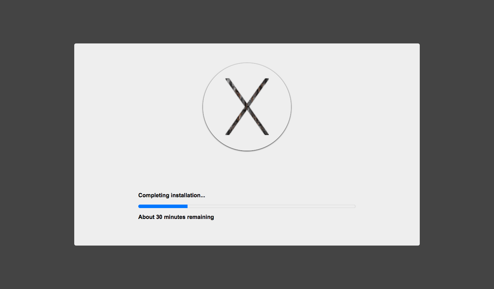

# OS X Update Simulator

There is no need to download and install your OS X update on your Mac!  
You can instantly and safely simulate the OS X installation in your browser.

The less time you spent on this page, the faster your udpate proceeds. Awesome, isn't it?

[http://jomo.tv/osxupdatesimulator/
](http://jomo.tv/osxupdatesimulator/)

Pro tip: Click into the page to open in full screen!

# License

  
[WTFPL](LICENSE.txt)

#### Note

Not affiliated with Apple Inc.  
Mac and OS X are trademarks of Apple Inc., registered in the U.S. and other countries.
